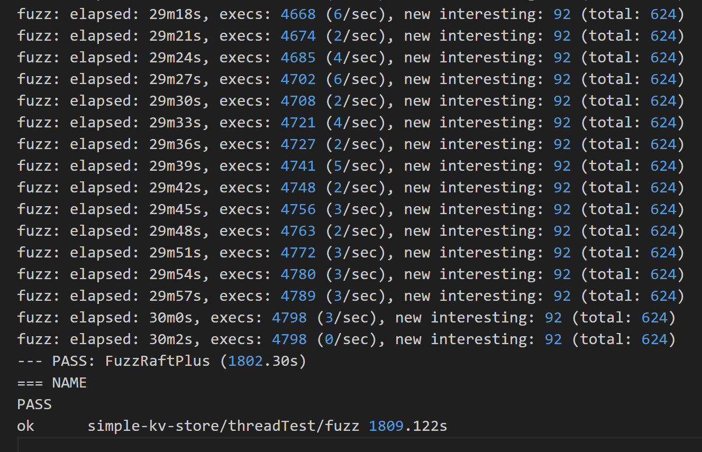
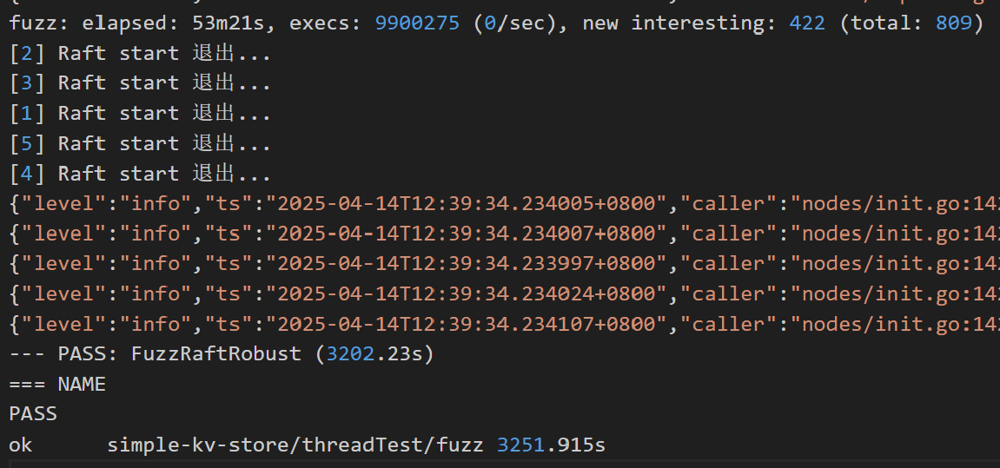
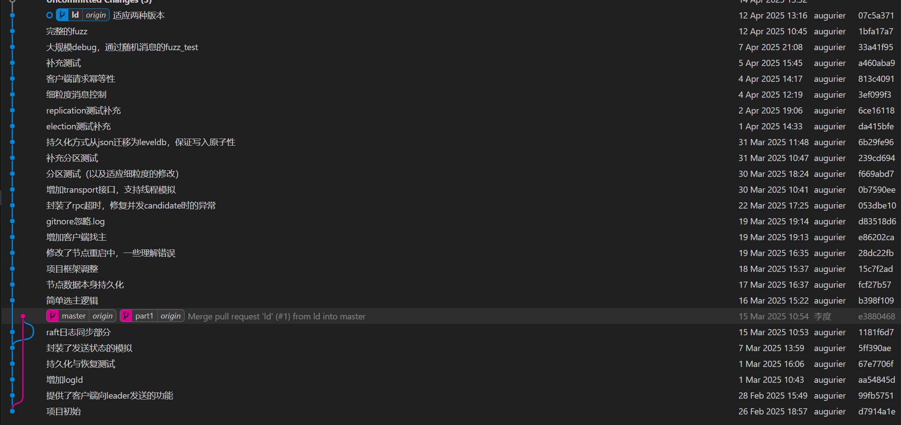

# go-raft-kv

---
# 简介
本项目是基于go语言实现的一个raft算法分布式kv数据库。   

项目亮点如下：  
支持线程与进程两种通信机制，方便测试与部署切换的同时，降低了系统耦合度  

提供基于状态不变量的fuzz测试机制，增强健壮性

项目高度模块化，便于扩展更多功能  

本报告主要起到工作总结，以及辅助阅读代码的作用（并贴出了一些关键部分），一些工作中遇到的具体问题、思考和收获不太方便用简洁的文字描述，放在了汇报的ppt中。  

# 项目框架
``` 
---cmd
    ---main.go  进程版的启动  
---internal  
    ---client 客户端使用节点提供的读写功能  
    ---logprovider 封装了简单的日志打印，方便调试  
    ---nodes 分布式核心代码
        init.go 节点的初始化（包含两种版本），和大循环启动  
        log.go 节点存储的entry相关数据结构  
        node_storage.go 抽象了节点数据持久化方法，序列化后存到leveldb里  
        node.go 节点的相关数据结构  
        random_timetake.go 控制系统中的随机时间  
        real_transport.go 进程版的rpc通讯  
        replica.go 日志复制相关逻辑  
        server_node.go 节点作为server为  client提供的功能（读写）
        simulate_ctx.go 测试中控制通讯消息行为  
        thread_transport.go 线程版的通讯方法  
        transport.go 为两种系统提供的基类通讯接口  
        vote.go 选主相关逻辑  
---test 进程版的测试  
---threadTest 线程版的测试  
    ---fuzz 随机测试部分  
    election_test.go 选举部分  
    log_replication_test.go 日志复制部分  
    network_partition_test.go 网络分区部分  
    restart_node_test.go 恢复测试  
    server_client_test.go 客户端交互  
```

# raft系统部分
## 主要流程
在init.go中每个节点会初始化，发布监听线程，然后在start函数开启主循环。主循环中每隔一段心跳时间，如果判断自己是leader，就broadcast并resetElectionTime。（init.go） 
```go
func Start(node *Node, quitChan chan struct{}) {
	node.Mu.Lock()
	node.State = Follower     // 所有节点以 Follower 状态启动
	node.Mu.Unlock()
	node.ResetElectionTimer() // 启动选举超时定时器

	go func() {
		ticker := time.NewTicker(50 * time.Millisecond)
		defer ticker.Stop()

		for {
			select {
			case <-quitChan:
				fmt.Printf("[%s] Raft start 退出...\n", node.SelfId)
				return // 退出 goroutine

			case <-ticker.C:
				node.Mu.Lock()
				state := node.State
				node.Mu.Unlock()
	
				switch state {
				case Follower:
					// 监听心跳超时
	
				case Leader:
					// 发送心跳
					node.ResetElectionTimer() // leader 不主动触发选举
					node.BroadCastKV()
				}
			}
		}
	}()
}
```

两个监听方法：  
appendEntries：broadcast中遍历每个peerNode，在sendkv中进行call，实现日志复制相关逻辑。  
requestVote：每个node有个ResetElectionTimer定时器，一段时间没有reset它就会StartElection，其中遍历每个peerNode，在sendRequestVote中进行call，实现选主相关逻辑。leader会在心跳时reset（避免自己的再选举），follower则会在收到appendentries时reset。 

```go
func (node *Node) ResetElectionTimer() {
	node.MuElection.Lock()
	defer node.MuElection.Unlock()
	if node.ElectionTimer == nil {
		node.ElectionTimer = time.NewTimer(node.RTTable.GetElectionTimeout())
		go func() {
			for {
				<-node.ElectionTimer.C
				node.StartElection()
			}
		}()
	} else {
		node.ElectionTimer.Stop()
		node.ElectionTimer.Reset(time.Duration(500+rand.Intn(500)) * time.Millisecond)
	}
}
```

## 客户端工作原理（client & server_node.go）
### 客户端写
客户端每次会随机连上集群中一个节点，此时有四种情况：  
a 节点认为自己是leader，直接处理请求（记录后broadcast）  
b 节点认为自己是follower，且有知道的leader，返回leader的id。客户端再连接这个新的id，新节点重新分析四种情况。  
c 节点认为自己是follower，但不知道leader是谁，返回空的id。客户端再随机连一个节点  
d 连接超时，客户端重新随机连一个节点  
```go
func (client *Client) Write(kv nodes.LogEntry) Status {
	kvCall := nodes.LogEntryCall{LogE: kv, 
		Id: nodes.LogEntryCallId{ClientId: client.ClientId, LogId: client.NextLogId}}
	client.NextLogId++

	c := client.FindActiveNode()
	var err error

	timeout := time.Second
	deadline := time.Now().Add(timeout)

	for { // 根据存活节点的反馈，直到找到leader
		if time.Now().After(deadline) {
			return Fail
		}

		var reply nodes.ServerReply
		reply.Isleader = false
		
		callErr := client.Transport.CallWithTimeout(c, "Node.WriteKV", &kvCall, &reply) // RPC
		if callErr != nil { // dial和call之间可能崩溃，重新找存活节点
			log.Error("dialing: ", zap.Error(callErr))
			client.CloseRpcClient(c)
			c = client.FindActiveNode()
			continue
		}

		if !reply.Isleader { // 对方不是leader，根据反馈找leader
			leaderId := reply.LeaderId
			client.CloseRpcClient(c)
			if leaderId == "" { // 这个节点不知道leader是谁，再随机找
				c = client.FindActiveNode()
			} else { // dial leader
				c, err = client.Transport.DialHTTPWithTimeout("tcp", "", leaderId)
				if err != nil { // dial失败，重新找下一个存活节点
					c = client.FindActiveNode()
				}				
			}
		} else { // 成功
			client.CloseRpcClient(c)
			return Ok
		}		
	}
}
```

### 客户端读
随机连上集群中一个节点，读它commit的kv。  

## 重要数据持久化
封装在了node_storage.go中，主要是setTermAndVote序列化后写入leveldb，log的写入。在这些数据变化时调用它们进行持久化，以及相应的恢复时读取。 
```go
// SetTermAndVote 原子更新 term 和 vote
func (rs *RaftStorage) SetTermAndVote(term int, candidate string) {
	rs.mu.Lock()
	defer rs.mu.Unlock()
	if rs.isfinish {
		return
	}

	batch := new(leveldb.Batch)
	batch.Put([]byte("current_term"), []byte(strconv.Itoa(term)))
	batch.Put([]byte("voted_for"), []byte(candidate))

	err := rs.db.Write(batch, nil) // 原子提交
	if err != nil {
		log.Error("SetTermAndVote 持久化失败:", zap.Error(err))
	}
}
``` 

## 两种系统的切换
将raft系统中，所有涉及网络的部分提取出来，抽象为dial和call方法，作为每个node的接口类transport的两个基类方法，进程版与线程版的transport派生类分别实现，使得相互之间实现隔离。  
```go
type Transport interface {
    DialHTTPWithTimeout(network string, myId string, peerId string) (ClientInterface, error)
    CallWithTimeout(client ClientInterface, serviceMethod string, args interface{}, reply interface{}) error
}
```

进程版：dial和call均为go原生rpc库的方法，加一层timeout封装（real_transport.go）  
线程版：threadTransport为每个节点共用，节点初始化时把一个自己的chan注册进里面的map，然后go一个线程去监听它，收到req后去调用自己对应的函数（thread_transport.go）  

# 测试部分
## 单元测试
从Leader选举、日志复制、崩溃恢复、网络分区、客户端交互五个维度，对系统进行分模块的测试。测试中夹杂消息状态的细粒度模拟，尽可能在项目前中期验证代码与思路的一致性，避免大的问题。

## fuzz测试
分为不同节点、系统随机时间配置测试异常的多系统随机（basic），与对单个系统注入多个随机异常的多系统随机（robust），这两个维度，以及最后综合两个维度的进一步测试（plus）。  
fuzz test不仅覆盖了单元测试的内容，也在随机的测试中发现了更多边界条件的异常，以及通过系统状态的不变量检测，确保系统在不同配置下支持长时间的运行中保持正确可用。  

  



## bug的简单记录
LogId0的歧义，不同接口对接日志编号出现问题  
随机选举超时相同导致的candidate卡死问题  
重要数据持久化不原子、与状态机概念混淆  
客户端缺乏消息唯一标识，导致系统重复执行 
重构系统过程中lock使用不当   
伪同步接口的异步语义陷阱  
测试和系统混合产生的bug（延迟导致的超时、退出不完全导致的异常、文件系统异常、lock不当）  

# 环境与运行
使用环境是wsl+ubuntu  
go mod download安装依赖  
./scripts/build.sh 会在根目录下编译出main（进程级的测试需要）    

# 参考资料
In Search of an Understandable Consensus Algorithm  
Consensus: Bridging Theory and Practice  
Raft TLA+ Specification  
全项目除了logprovider文件夹下的一些go的日志库使用参考了一篇博客的封装，其余皆为独立原创。  

# 分工
| 姓名 | 工作 | 贡献度 |
|--------|--------|--------|
| 李度  | raft系统设计+实现，测试设计+实现  | 75% |
| 马也驰  | raft系统设计，测试设计+实现 | 25% |



